***
 
 

### Fachhochschule Bielefeld

### Softwaretechnik und Programmierung  
###### Prof. Dr. Jörg Brunsmann
 
 
 

# Software Engineering  

## Kapitel 1. Einleitung  
 
 
 

### *(Kommentare der Projektgruppe in Kursiv)*
 
 
 

***
FH Bielefeld | Software Engineering | Seite 1  
 
 
 

***
 
 
 

# Begrifflichkeit:  
 
 

## „Software Engineering“ = „Softwaretechnik“  
 

### *Die Softwaretechnik ist eine deutschsprachige Übersetzung des engl. Begriffs Software Engineering (SWE) und beschäftigt sich mit der Herstellung oder Entwicklung von Software, der Organisation und Modellierung der zugehörigen Datenstrukturen und dem Betrieb von Softwaresystemen. [Quelle: Wikipedia]*
 
 
 
 
 
 
 

***
FH Bielefeld | Software Engineering | Seite 2
 
 
 

***
 

# **Lernziele für heute**  
 
 
 

- ### Verstehen, warum Software schwer zu entwickeln ist
 
- ### Erklären können, warum Softwaretechnik notwendig ist  

- ### Unterschiedliche Arten von Software kennen  

- ### Wissen, welche typischen Phasen in einem Softwareprojekt existieren  

- ### Verständnis für Rollen in einem Softwareprojekt entwickeln  

- ### Verstehen, dass zur Softwareentwicklung mehr gehört als die reine Programmierung

 
 
 
 
 

***
FH Bielefeld | Software Engineering | Seite 3
 
 
 

***
 
 
 

# Was ist Software?
 
 

### *Software [ˈsɒf(t)wɛː] (dt. = weiche Ware [von] soft = leicht veränderbare Komponenten […], Komplement zu ‚Hardware‘ für die physischen Komponenten) ist ein Sammelbegriff für Programme und die zugehörigen Daten. Sie kann als Beiwerk zusätzlich Bestandteile wie z. B. die Softwaredokumentation in der digitalen oder gedruckten Form eines Handbuchs enthalten. [Quelle: Wikipedia]*

### *Software bestimmt, was ein softwaregesteuertes Gerät tut und wie es das tut (in etwa vergleichbar mit einem Manuskript). Die Hardware (das Gerät selbst) führt Software aus (arbeitet sie ab) und setzt sie so in die Tat um. Software ist die Gesamtheit von Informationen, die man der Hardware hinzufügen muss, damit ein softwaregesteuertes Gerät für ein definiertes Aufgabenspektrum nutzbar wird. [Quelle: Wikipedia]*
 
 
 
 
 

***
FH Bielefeld | Software Engineering | Seite 4
 
 
 

***

## Was ist Software?
 
 

### Die Software ist nur die Spitze des Eisbergs des Software-Produkts
 

### Software ist ein umfassenderer Begriff als „Programm“

- ### Software besteht ebenfalls aus der zugehörigen Dokumentation

- ### Software enthält alle Elemente, die für den Betrieb notwendig sind. z.B. Datenbankskripte, Dokumentation, Betriebshandbücher, usw.
 
 
 
 
 
 
 

***
FH Bielefeld | Software Engineering | Seite 5
 
 
 

***
## Was ist Software?
### - „Programme, zugehörige Daten und Dokumentationen, die es zusammengefasst erlauben, mit Hilfe eines Computers Aufgaben zu erledigen.“
 

 

## Softwaresystem
### Ein *Softwaresystem* ist ein System, dessen Bestandteile und Elemente aus Software bestehen („innere“ Sicht des Softwareentwicklers)
 
 

## Softwareprodukt
### Ein *Softwareprodukt* ist ein für einen Auftraggeber erstelltes Softwaresystem („äußere“ Sicht)
 
 

***
FH Bielefeld | Software Engineering | Seite 6
 
 
 
 

***
## Arten von Software
 

- ### Systemsoftware (z.B. Betriebssystem)

- ### Anwendungssoftware (z.B. Büroanwendungen, Office)

- ### Standardsoftware (anpassbare Software für anonyme Kunden, z.B. SAP)  

- ### Individualsoftware  

    - #### Speziell für einen Kunden/Auftraggeber entwickelte Software
  
    - #### Exakt auf die Bedürfnisse des Kunden zugeschneidertes Produkt  
    
    - #### Relativ zeitaufwändige und teure Entwicklung  

    - #### Typische Beispiele: Software zur Unterstützung spezieller Geschäftsprozesse  

- ### Eingebettete Systeme (Steuerungssoftware für Geräte)

- ### Echzeitsysteme (z.B. Flugüberwachung und Kraftwerkssteuerung)

- ### Informationssysteme (datenbankgestützte Verwaltung von Information), oft webbasiert
 

***
FH Bielefeld | Software Engineering | Seite 7
 
 
 

***
## Eigenschaften von Software
 
 
 
 
 
 

- ### Software kann man nicht anfassen: Software ist immateriell

- ### Entwicklungsfortschritt ist nicht objektiv messbar

- ### Anders als materielle Produkte verschleißt Software nicht 

- ### Software verschleißt zwar nicht, altert aber dennoch

    - #### Die Umgebung, in der Software eingesetzt wird, ändert sich ständig
  
    - #### Software muss daher diesen Änderungen immer wieder angepasst werden
 
 
 
 
 

***
FH Bielefeld | Software Engineering | Seite 8
 
 
 

***
 
 
 
 
 
 
 
 
 
 

# Software Projekte
 
 
 
 
 
 
 
 
 
 
 
 

***
FH Bielefeld | Software Engineering | Seite 9
 
 
 

***

## Was ist ein Projekt ?
- ### Ein Projekt ist ein Vorhaben, das im wesentlichen durch die Einmaligkeit der Bedingungen in ihrer Gesamtheit gekennzeichnet ist, wie z.B.:
 
    - #### Zielvorgabe
      
    - #### Zeitliche, finanzielle, personelle oder andere Begrenzungen
 

| **Projektgröße** | **Kriterien** | **Beispiele** |    
| ------------ | --------- | ----      |    
| Light        | Bis zu 6 Personen Personen-Monate (PM): 0-8 Anzahl Technologien: <5 | Rechenprobleme, Algorithmen |  
| Medium       | 10-30 Personen 9-24 PM 5-12 Technologien | Buchhaltung, Lagerverwaltung |  
| Heavy        | 50-100 Personen 25-45 PM 12-20 Technologien | Compiler, Datenbank |  
| Super Heavy  | ab 100 Personen >45 PM >20 Technologien | Raumfahrt, Atomkraftwerk, elektronische Börse |  

***
FH Bielefeld | Software Engineering | Seite 10
 
 
 

***
 
 
 
 
 
 
 
 
 
 

# Klassischer Software Lebenszyklus
 
 
 
 
 
 
 
 
 
 
 
 

***
FH Bielefeld | Software Engineering | Seite 11
 
 
 

***
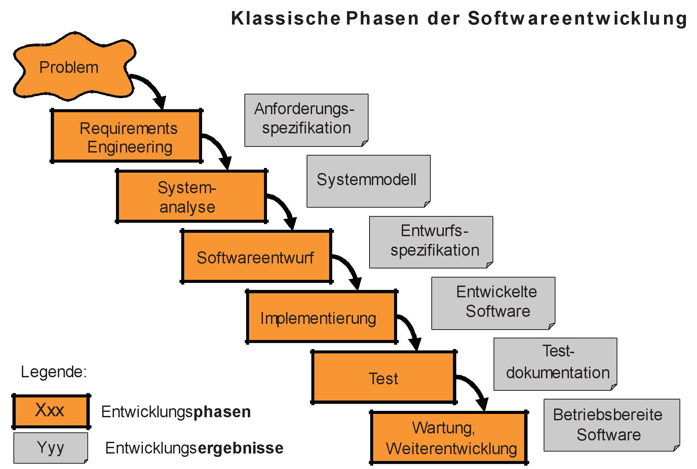

***
FH Bielefeld | Software Engineering | Seite 12
 
 
 

***
## Phasen eines Vorgehensmodells
- ### Anforderungsermittlung: Wie findet man heraus, welche Eigenschaften (insbesondere Funktionalität) die zu konstruierende Software haben soll?

- ### Analyse: Wie beschreibt man dann diese Eigenschaften?

- ### Entwurf: Wie strukturiert man die Software so, dass sie sich leicht bauen und flexibel verändern lässt?

- ### Implementierung: Wie realisiert man effizient und fehlerfrei die Software?

- ### Wartung: Wie verändert man Software, die keine solche Struktur hat oder deren Struktur man nicht (mehr) versteht?

- ### Test: Wie vermeidet man Mängel in Software oder deckt sie auf?

- ### Übergeordnet
 
    - ### Prozessmanagement: Wie organisiert man die Arbeit einer Softwareabteilung, um regelmäßig kostengünstige und hochwertige Resultate termingerecht zu erzielen?
     
### Die Lehrveranstaltung orientiert sich an diesen Phasen eines Softwareprojekts als „roter Faden“ und stellt die Phasen anhand von Vorgehensmodellen vor, wobei verschiedene UML-Diagramme verwendet werden.

***
FH Bielefeld | Software Engineering | Seite 13
 
 
 

***
 
 
 
 
 
 
 
 
 
 

# Rollen in der Softwareentwicklung
 
 
 
 
 
 
 
 
 
 
 
 

***
FH Bielefeld | Software Engineering | Seite 14
 
 
 

***
 

## Begriff der Rolle
- ### Eine Rolle beschreibt eine Menge von zusammengehörigen Aufgaben und Befugnissen (oft auch notwendige Qualifikationen)

- ### Eine Rolle wird von Personen wahrgenommen

- ### Eine Person kann mehrere Rollen einnehmen

- ### Eine Rolle kann von mehreren Personen eingenommen werden

- ### Nicht in jeder Softwareentwicklung treten alle Rollen auf, abhängig von Artund Größe des Projekts
 
 
 

## Ziel der Rolle
- ### Kooperation zwischen den beteiligten Personen durch Verständnis für die Aufgaben
 
 
 
 

***
FH Bielefeld | Software Engineering | Seite 15
 
 
 

***
# Beteiligte

- ## Auftraggeber
    - ### Geben Geld, haben unterschiedliche Bedürfnisse

- ## Benutzer
    - ### Setzen Software ein
    - ### Manchmal mit Auftraggeber identisch

- ## Manager
    - ### Fällen während der Entwicklung die organisatorischen Entscheidungen

- ## Berater
    - ### Unterstützen den Kunden in der Definition der Anforderungen

- ## Entwickler
    - ### Definieren und bauen Software
    - ### in verschiedenen Rollen ( d.h. mit verschiedenartigen Aufgaben)

***
FH Bielefeld | Software Engineering | Seite 16
 
 
 

***
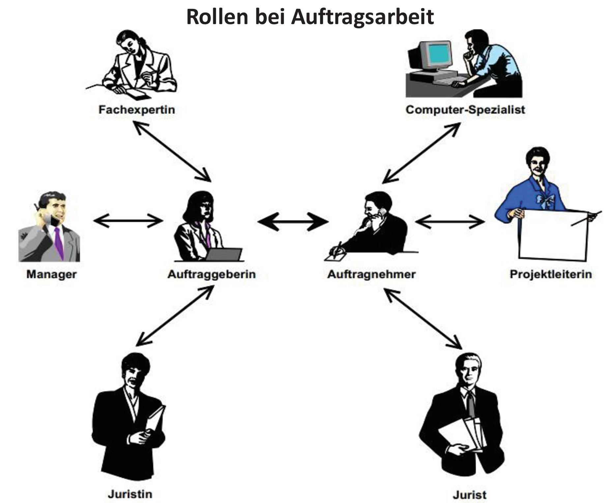

***
FH Bielefeld | Software Engineering | Seite 17
 
 
 

***
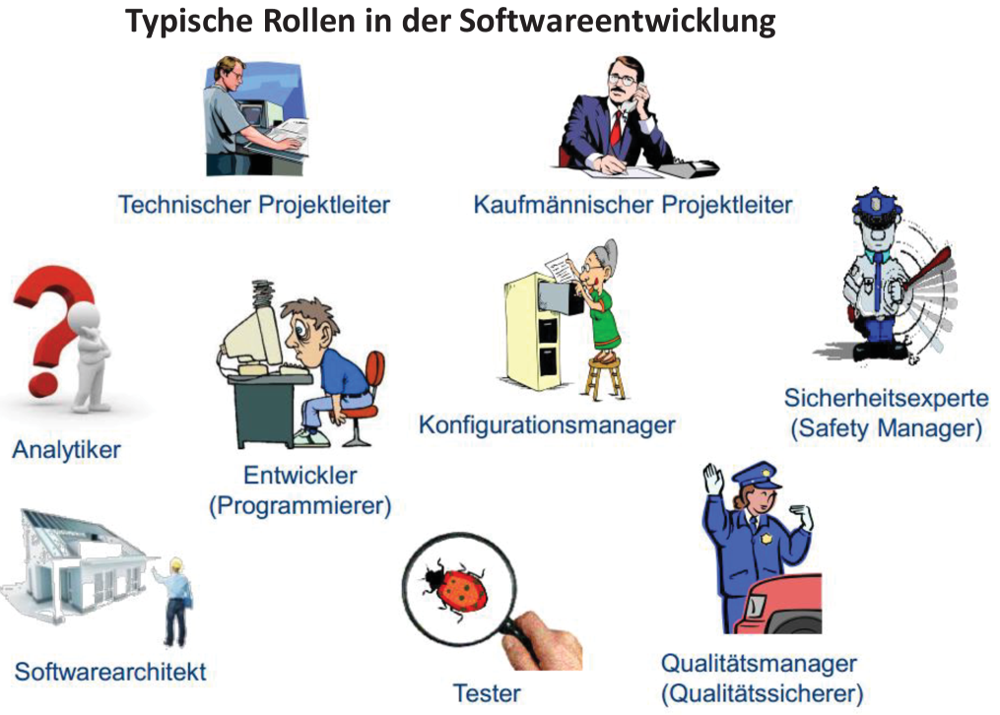

***
FH Bielefeld | Software Engineering | Seite 18
 
 
 

***
 
 
 
 
 
 
 
 
 
 

# Rollen aus Informatik-Perspektive
 
 
 
 
 
 
 
 
 
 
 
 

***
FH Bielefeld | Software Engineering | Seite 19
 
 
 

***

# Projektmanager
 

## Der *Projektmanager* hat das Ziel einer erfolgreichen Projektdurchführung. Er ist für alle Phasen des Projekts zuständig und trifft wesentliche Entscheidungen
 

## Aufgaben/Aktivitäten:
 

- ### Planung des Projekts: Projektorganisation; Kostenschätzung und Planung; Erstellung eines Projektplans

- ### Kontrolle des Projekts: Produktverfolgung; Planüberprüfung; Produktivitätsüberwachung

- ### Steuerung des Projekts: Projektkoordination
 
 
 
 
 

***
FH Bielefeld | Software Engineering | Seite 20
 
 
 

***

# Anforderungsanalytiker
 

## Der *Anforderungsanalytiker* kümmert sich um die Aufnahme und Überprüfung von Anforderungen an das System. „Was“ soll das System leisten? Diese Charakteristika sind vor allem in den „frühen“ Phasen der Produktentwicklung vorhanden. 

## Aufgaben/Aktivitäten:

- ### Ermitteln und Erkennen von Benutzer-Anforderungen: „Was macht das derzeitige System“; Ist-Analyse; Soll- Analyse: „Was soll das zukünftige System tun?“

- ### Machbarkeitsstudie: Bewertung der Ist- und Soll-Analyseergebnisse

- ### Integration unterschiedlicher Sichten/Ziele: Kommunikation mit Anwendern, Kunden etc. und Übereinstimmung der Beteiligten bzgl. der definierten Anforderungen

- ### Erstellung eines Anforderungsdokuments

***
FH Bielefeld | Software Engineering | Seite 21
 
 
 

***

# Software-Architekt
 

## Der *Software-Architekt* ist für die Architektur des Systems zuständig. Er kümmert sich somit um den Übergang vom Problem zur Realisierung („Wie“)
 

## Aufgaben/Aktivitäten:
 

- ### Zuordnung von Anforderungen auf Komponente/Subsysteme

- ### Grobentwurf: Subsysteme, evtl. grobgranulare Komponenten und deren Beziehungen;

- ### Sicherstellung von Qualitätsattributen (Struktur des Systems beeinflusst Qualitätsattribute)

- ### Dokumentation der Systemarchitektur
 
 
 

***
FH Bielefeld | Software Engineering | Seite 22
 
 
 

***

# Software-Designer
 

## Der *Software-Designer* fertigt eine Beschreibung des Verhaltens, der Daten und der Funktionen des Systems an. Er entwirft eine „implementierungsnahe“ Spezifikation der Anforderungen an das Softwaresystem („technische Anforderungen“)
 

## Aufgaben/Aktivitäten:
 

- ### Modellierung/ Beschreibung der Anforderungen au „Implementierungssicht“ (Kommunikation mit Architekt und Programmierer)

- ### Feinentwurf: Detaillierter Entwurf des Systems (Komponenten, Interfaces, Klassen)

 
 
 
 

***
FH Bielefeld | Software Engineering | Seite 23
 
 
 

***

# Programmierer/Entwickler

## Der *Programmierer/Entwickler* kümmert sich um die programmiertechnische Umsetzung (Realisierung, Implementierung) des Entwurfs
 

## Aufgaben/Aktivitäten:
 

- ### Programmierung der einzelnen Komponenten

- ### Dokumentation des Programmcodes

- ### Definition der spezifischen Algorithmen

- ### Beachtung von Standards

- ### Entwickler-Test der Module (z.B. JUnit-Tests)

- ### Code-Reviews

 
 

***
FH Bielefeld | Software Engineering | Seite 24
 
 
 

***

# Tester

## Der *Tester* führt das System aus, um Hinweise auf Fehler zu finden (Systemtests, Integrationstests).  Abwesenheit von Fehlern kann durch Testen NICHT garantiert werden.
 

## Aufgaben/Aktivitäten:
 

- ### Detaillierung von Testplan, Testentwurf und Testfällen

- ### Durchführung von Tests (Dokumentation der Testbedingungen und Testergebnissen)

- ### Überprüfung der Zusammenarbeit der Komponenten

- ### Überprüfung des Gesamtsystems

 
 
 

***
FH Bielefeld | Software Engineering | Seite 25
 
 
 

***

# Konfigurationsmanager
 

## Der *Konfigurationsmanager* kümmert sich um die Festlegung der Regelungen für Konfigurations- und Produktverwaltung.
 

## Aufgaben/Aktivitäten:
 

- ### Überwachung der Konfiguration des Produkts Konfigurationskontrolle und Statusverfolgung

- ### Nachvollziehbarkeit und Konsistenz: Sicherstellung von Sichtbarkeit, Verfolgbarkeit  und Kontrollierbarkeit eines Produkts und seiner Teile im Lebenszyklus

 
 
 
 
 

***
FH Bielefeld | Software Engineering | Seite 26
 
 
 

***

 

# Administrator

## Der *Administrator* kümmert sich um den Betrieb des Softwaresystems.
 

## Aufgaben/Aktivitäten:
 

- ### Installation der Software

- ### Überwachung des laufenden Software durch Monitoring von Log-Files

- ### Einspielen von Software-Updates

 
 
 
 
 
 

***
FH Bielefeld | Software Engineering | Seite 27
 
 
 

***
 
 
 
 
 
 
 
 
 
 

# Unterschiedliche Projektgrößen
 
 
 
 
 
 
 
 
 
 
 
 

***
FH Bielefeld | Software Engineering | Seite 28
 
 
 

***

# Entwicklung von kleinen / großen Softwaresystemen
 

## Die Herstellung großer Softwaresysteme mit Millionen von Codezeilen unterscheidet sich auch qualitativ und nicht nur quantitativ von der Herstellung kleiner Software.
 

- ### Die Komplexität großer Softwaresysteme übersteigt die von einem Entwickler zu einem Zeitpunkt zu beherrschendeKomplexität

- ### Die Wahrscheinlichkeit für die Korrektheit eines Systems von viel en „Modulen“ ist wesentlich kleiner als die Wahrscheinlichkeit für die Korrektheit einzelner „Module“

- ### Langlebigkeit und Versionierung großer Softwaresysteme ist problematisch

- ### Kommunikation unter vielen beteiligten Personen gestaltet sich schwierig
 
 
 
 
 

***
FH Bielefeld | Software Engineering | Seite 29
 
 
 

***
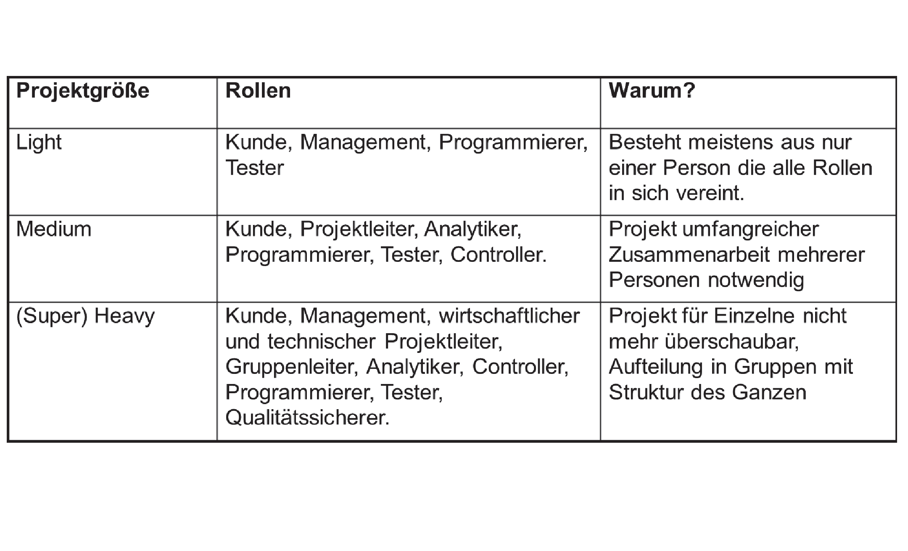

***
FH Bielefeld | Software Engineering | Seite 30
 
 
 

***
 
 
 
 
 
 
 
 
 
 

# Software Qualität
 
 
 
 
 
 
 
 
 
 
 
 

***
FH Bielefeld | Software Engineering | Seite 31
 
 
 

***

***
FH Bielefeld | Software Engineering | Seite 32
 
 
 

***
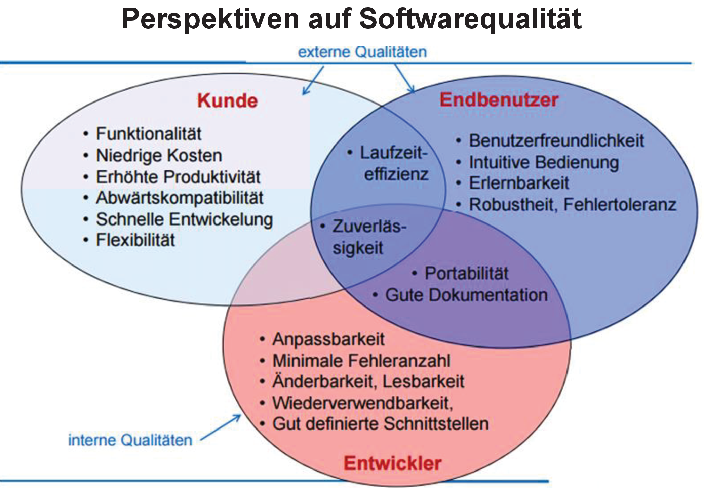

***
FH Bielefeld | Software Engineering | Seite 33
 
 
 

***

# Interessenskonflikte

- ### Funktionalität vs. Benutzbarkeit
    - ### Je überladener, um so schwerer zu erlernen

- ### Funktionalität vs. schnelle Entwicklung
    - ### Viel Funktionalität zu implementieren braucht Zeit

- ### Kosten vs. Robustheit
    - ### Sparen an Qualitätssicherung

- ### Kosten vs. Wiederverwendbarkeit
    - ### Quick and dirty

- ### Effizienz vs. Portabilität
    - ### Effizienz durch Speziallösung für bestimmtes Betriebssystem, DBMS, ...

- ### Abwärtskompatibilität vs. Lesbarkeit
    - ### Viele Sonderfälle für Altversionen erschweren die Lesbarkeit

***
FH Bielefeld | Software Engineering | Seite 34
 
 
 

***
 
 
 
 
 
 
 
 
 
 

# Probleme in der Software Entwicklung
 
 
 
 
 
 
 
 
 
 
 
 

***
FH Bielefeld | Software Engineering | Seite 35
 
 
 

***
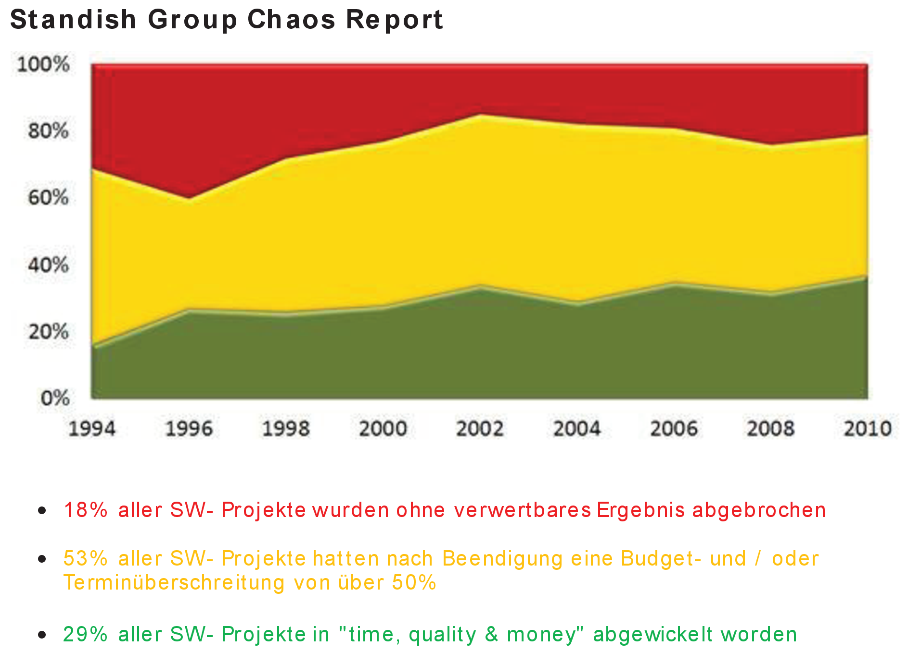

***
FH Bielefeld | Software Engineering | Seite 36
 
 
 

***
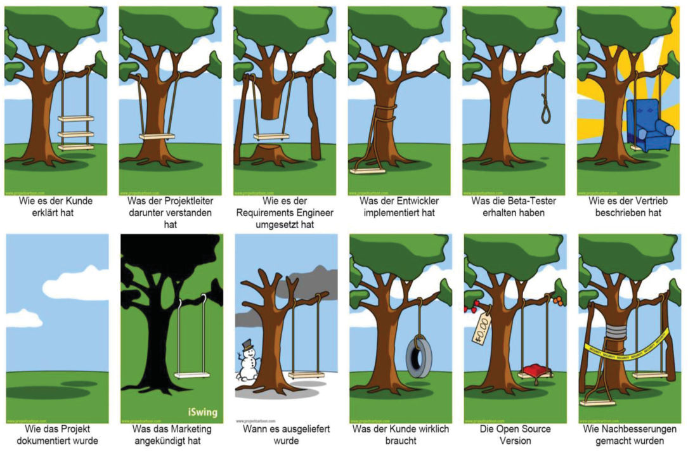

***
FH Bielefeld | Software Engineering | Seite 37
 
 
 

***

## Ursachen für schlechte Software-Qualität

- Unvollständige Anforderungen

- Zu wenig Ressourcen bzw. falsche Schätzung benötigter Ressourcen

- Unrealistische Zeit- und Kostenpläne

- schlechtes Projektmanagement

- Häufige Änderung der Anforderungen

- Qualitätsmängel bei extern vergebenen Aufgaben

- Pflege von Altsystemen ist schwierig

- Fehlende Planung (unklare Verantwortlichkeit)

- Projekt wird nicht mehr benötigt

- Vielzahl an anderen Dokumenten neben dem Source-Code

- unrealistische oder unausgesprochene Projektziele

- schlecht definierte Anforderungen (unklare Zielvorstellung)

- Die Komplexität und Lebensdauer von Software nimmt zu

- nicht gemanagte Risiken

- schlechte Kommunikation zwischen Kunden, Entwicklern und Benutzern

- Anwender nicht involviert

- Verwendung unausgereifter Technologie

- Unfähigkeit, die Projektkomplexität in den Griff zu kriegen

- nachlässige Entwicklungspraktiken

- „politische“ Gründe der Beteiligten

- kommerzieller Druck

- UnvollständigeDokumentation

- Ursachen in Organisation, Technologie, Methodik

***
FH Bielefeld | Software Engineering | Seite 38
 
 
 

***
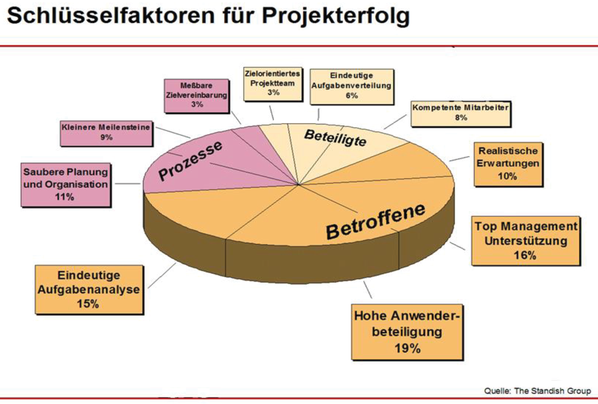

***
FH Bielefeld | Software Engineering | Seite 39
 
 
 

***
 
 
 
 
 
 
 
 
 
 

# Softwarekosten
 
 
 
 
 
 
 
 
 
 
 
 

***
FH Bielefeld | Software Engineering | Seite 40
 
 
 

***

# Softwarekosten
 

- ## Die Wartung der Software ist teurer als die Entwicklung.

- ## Kosten für das Testen sind fast so hoch wie die Entwicklungskosten.

- ## Kosten variieren je nach Typ des zu entwickelnden Systems, sowie nach den Anforderungen an die Systemattribute,wie Performance und Systemzuverlässigkeit.

- ## Verteilung der Kosten ist abhängig vom verwendeten Vorgehensmodell.

- ## Die Mehrzahl der Softwareentwickler sind mit Pflegearbeiten beschäftigt.
 
 
 

***
FH Bielefeld | Software Engineering | Seite 41
 
 
 

***

***
FH Bielefeld | Software Engineering | Seite 42
 
 
 

***

***
FH Bielefeld | Software Engineering | Seite 43
 
 
 

***
 
 

- # Folgende Bedingungen seien gegeben:
    - ### mehr als eine Person entwickelt die Software
    - ### mehr als eine Version der Software existiert
 
 
 

- # Software-Engineering soll helfen, diese Probleme nicht entstehen zu lassen oder zu beseitigen.
 

- # Was ist Software-Engineering?
 
 
 
 
 
 

***
FH Bielefeld | Software Engineering | Seite 44
 
 
 

***
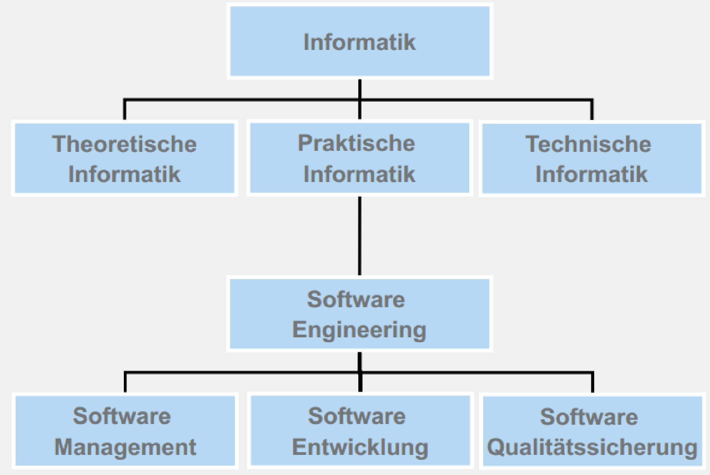

***
FH Bielefeld | Software Engineering | Seite 45
 
 
 

***
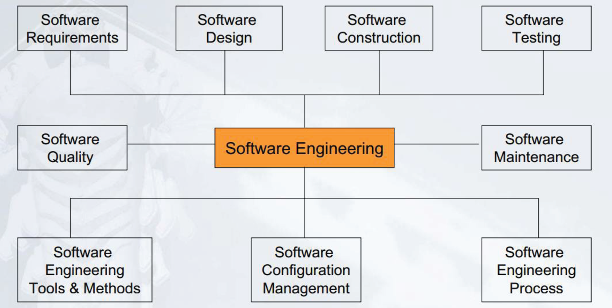

***
FH Bielefeld | Software Engineering | Seite 46
 
 
 

***
## Was ist Software Engineering?
 

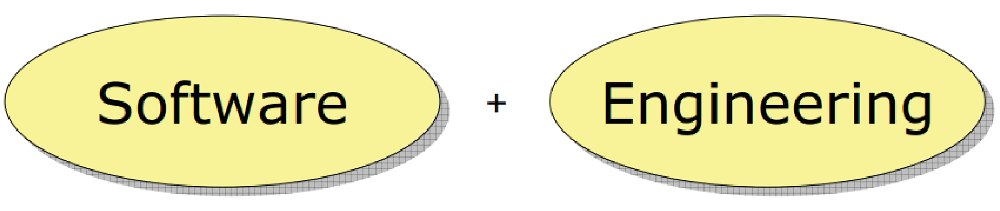

 
### Software Engineering ist der Einsatz von Methoden, Werkzeugen und Vorgehensmodelle zum Erstellen und Betreiben von Software mit dem Ziel, die Softwarekosten bei der Entwicklung, Wartung und Erweiterung von Programmsystemen zu senken und gleichzeitig eine hohe Qualität zu erreichen
 
 
 

***
FH Bielefeld | Software Engineering | Seite 47
 
 
 

***

## Ziele des Software Engineerings

- ### Schnelle und effiziente Entwicklung des Produkts (Entwicklungsaspekt)

- ### Einhaltung der geforderten Qualitätsmerkmale (Qualitätssicherungsaspekt)

- ### Kontrollierte Projektabwicklung (Managementaspekt)

- ### Sicherstellung der Wartbarkeit, Erweiterbarkeit, Wiederverwendbarkeit  (Wartungsaspekt)

 

## Software Engineering

- ### stellt die Qualität in den Mittelpunkt (Kundenzufriedenheit, Sicherheit)

- ### basiert auf (agilen) Vorgehensmodellen

- ### Entwicklung wird methodisch durchgeführt (OOA/OOD mit UML)

- ### Softwarewerkzeuge zur Beherrschung der Komplexität

 

***
FH Bielefeld | Software Engineering | Seite 48
 
 
 

***
 
 
 
 
 
 
 
 
 
 

# Zusammenfassung
 
 
 
 
 
 
 
 
 
 
 
 

***
FH Bielefeld | Software Engineering | Seite 49
 
 
 

***

## Zusammenfassung
 

- ### Software Engineering ist eine Ingenieur-Disziplin, die sich mit allen Aspekten der Softwareentwicklung und Softwarewartung beschäftigt.

- ### Ziel des Software Engineerings ist die Erreichung einer hohen Softwarequalität und die Minimierung der Softwarekosten.

- ### Software Engineering ist mehr als Technik und befasst sich mit Konzepten, Methoden und Werkzeugen für die professionelle Softwareentwicklung

- ### Softwareprodukte bestehen aus Programmen und der Dokumentation

- ### Software Ingenieure arbeiten in Teams in Software Projekten methodisch und strukturiert und kommunizieren mit Kunden und Teammitgliedern

- ### Software Ingenieure beherrschen die Technik und lassen sich nicht von der Technik beherrschen

- ### Der Softwareentwicklungsprozess besteht aus Phasen, die bei der Entwicklung des Softwareprodukts involviert sind. Die grundlegenden Phasen sind Analyse, Entwurf, Implementierung, Integration, Test, Wartung und Weiterentwicklung.
 

***
FH Bielefeld | Software Engineering | Seite 50
 
 
 

***

 
 
 
 
 
 

## Danke für Ihre Aufmerksamkeit.
 
 
 
 

## Fragen, Wünsche, Anregungen?
 
 
 
 
 
 
 
 

***
FH Bielefeld | Software Engineering | Seite 51
 
 
 

