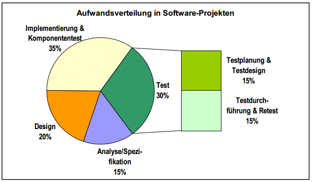
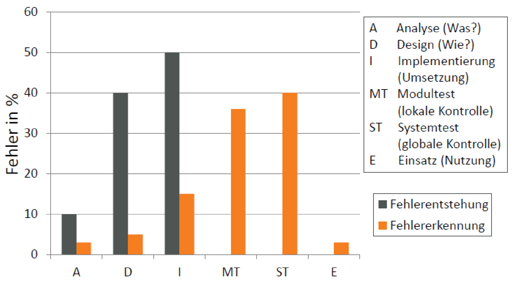
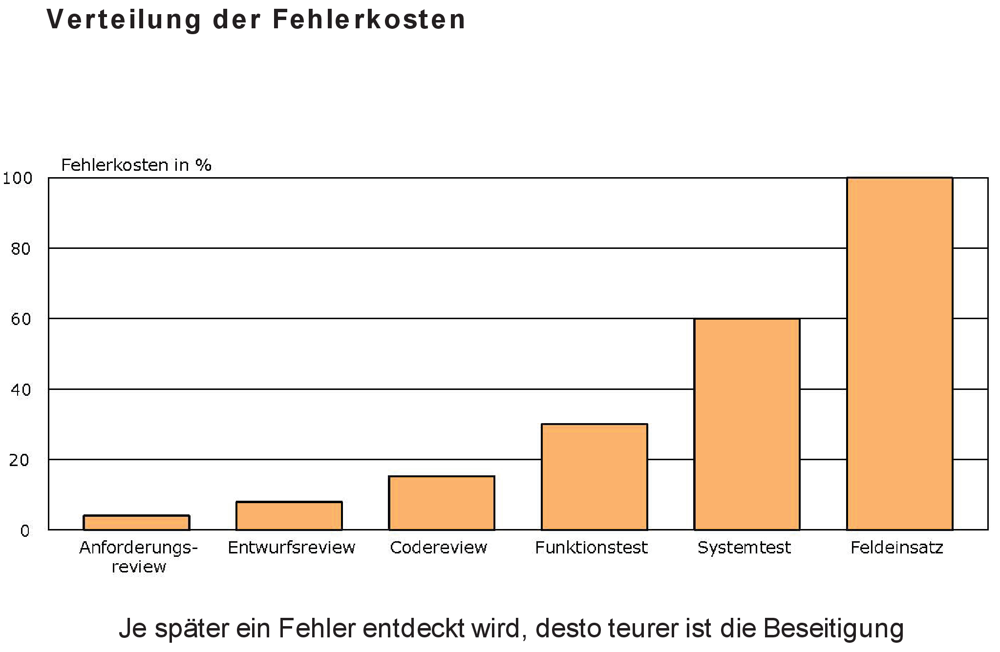
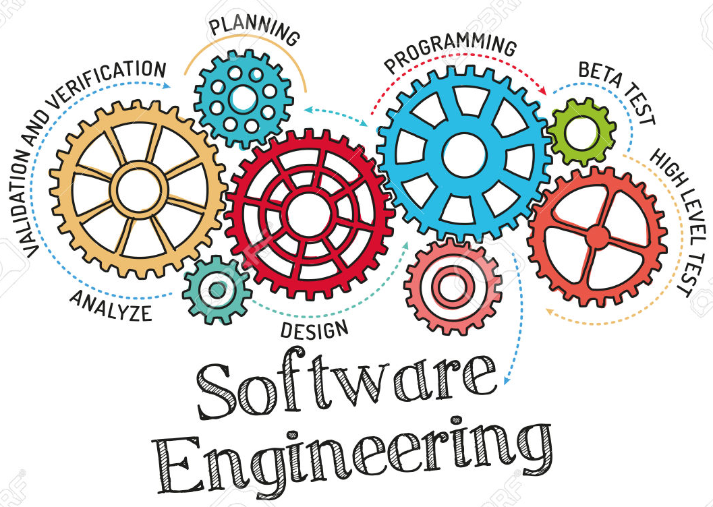
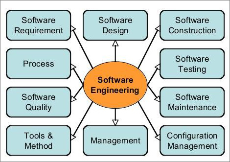
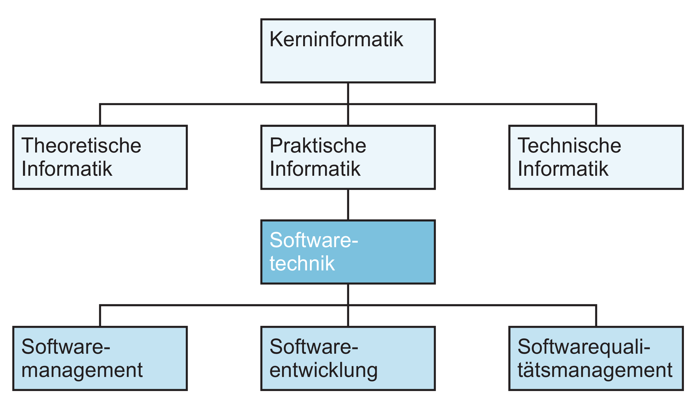
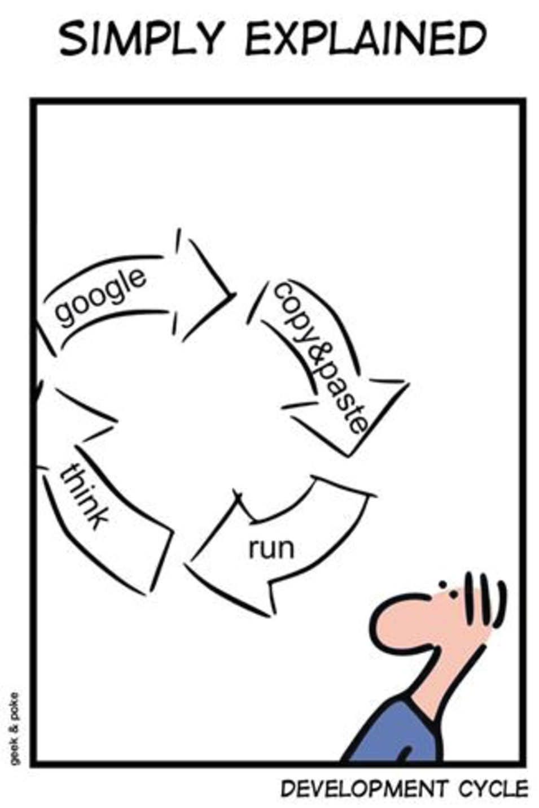

***
# Softwarekosten

## Die wichtigsten Kostenarten während der Softwareentwicklung sind:
### - Personalkosten (mit Abstand der größte Posten) - Lizenzkosten für zugekaufte Softwarekomponenten - anteilige Kosten für Entwicklungsumgebung (Hardware, Softwaretools - Auslagerungen/ Zukauf von Entwicklungsleistungen - externe Prüfungen - Recherchekosten (Normenrecherche, Urheberrechte...) - Sonstiges (Büromaterial, Reisekosten, usw.)

 

### Während der 'Entstehungsphase' kann man als Faustregel von folgender Aufwandsverteilung ausgehen:

 
 

### Wie man sieht, ist der Aufwand (und damit die Kosten), für das Testen der Software fast so hoch wie die Entwicklungskosten für Design, Implementierung und Komponententest.
 
 
 
 

***

## Nach der Entwicklung:
### In die Wartung fließt traditionell der größte Teil des Aufwandes des Software-Lebenszyklus. Der für die Wartung einzurechnende Aufwand steigt darüber hinaus stetig - rechnete man noch in den 1970er Jahren damit, dass der Wartungsaufwand 35 % bis 60 % des Gesamtaufwandes des Softwarelebenszyklusses ausmacht, stieg dieser bis Ende der 1990er Jahre auf 80 % bis 90 %. *[Wikipedia]*

## Die Wartung der Software ist somit deutlich teurer als die Entwicklung!
 

## Kostenfaktoren:
### Die maßgeblichen Faktoren für die Kosten eines Softwareprojektes sind:
- ### Typ des zu entwickelnden Systems (Größe, Umfang, Komplexität -> Quantitätsanforderung)
- ### geforderte Performance (als Qualitätsanforderung)
- ### geforderte Systemzuverlässigkeit (als Qualitätsanforderung)
- ### Produktivität der Mitarbeiter

### Zur Aufwandsschätzung eines Projektes gibt es verschiedene Basismethoden.
#### (Analogiemethode, Relationsmethode, Multiplikationsmethode...

## Verteilung der Kosten ist abhängig vom verwendeten Vorgehensmodell.

## Die Mehrzahl der Softwareentwickler sind mit Pflegearbeiten beschäftigt.
 
 
 
 
 
 

***

***

***
 

## Unter den Voraussetzungen:
### - mehr als eine Person entwickelt die Software bzw. das Softwareprodukt 
### - mehr als eine Version der Software existiert

## soll das *Software-Engineering* als Werkzeug dienen, die soeben dargestellten Probleme bei der Softwareentwicklung nicht entstehen zu lassen, zu beseitigen oder zumindest abzumildern.
 

## Damit ergeben sich zu diesem Zeitpunkt die Fragen:
 

# Was ist *Software-Engineering*?  
# Wie funktioniert *Software-Engineering*?
 
 

***
## Was ist Software Engineering?

## Software  +  Engineering (Ingenieurwissenschaften)

### "Unter Softwaretechnik (engl. Software Engineering) versteht man allgemein die (Ingenieur-) Wissenschaft, die die kosteneffiziente Entwicklung von qualitativ hochwertiger Software behandelt."
*Fachgruppe Softwaretechnik der Gesellschaft für Informatik*
### "Softwaretechnik, Softwaretechnologie, Software-Engineering das, –, Teilgebiet der Informatik, das sich mit Methoden und Werkzeugen für das ingenieurmäßige Entwerfen, Herstellen und Implementieren von Software befasst." 
*Brockhaus*
 
### Softwaretechnik: Zielorientierte Bereitstellung und systematische Verwendung von Prinzipien, Methoden und Werkzeugen für die arbeitsteilige, ingenieurmäßige Entwicklung und Anwendung von umfangreichen Softwaresystemen. Zielorientiert bedeutet die Berücksichtigung z. B. von Kosten, Zeit, Qualität.
*Helmut Balzert, Lehrbuch der Softwaretechnik*
 
 

***

## Phasen des Software Engineering
### Im Folgenden werden einige wichtige Aspekte und typische Stufen der Projektentwicklung dargestellt, die in der Praxis mehr oder weniger ausgeprägt zum Tragen kommen.

    

 

***

## Softwaretechnik als Teilgebiet der Informatik
### Die Softwaretechnik ist eine Teildisziplin der Informatik. Die Kerninformatik gliedert man in Theoretische, Praktische und Technische Informatik (siehe Abbildung). Die Softwaretechnik zählt zur Praktischen Informatik.
*Helmut Balzert, Lehrbuch der Softwaretechnik*
 
 

    

 

***

## Ziele des Software Engineerings

- ### Schnelle und effiziente Entwicklung des Produkts (Entwicklungsaspekt)

- ### Einhaltung der geforderten Qualitätsmerkmale (Qualitätssicherungsaspekt)

- ### Kontrollierte Projektabwicklung (Managementaspekt)

- ### Sicherstellung der Wartbarkeit, Erweiterbarkeit, Wiederverwendbarkeit  (Wartungsaspekt)

 

## Software Engineering

- ### stellt die Qualität in den Mittelpunkt (Kundenzufriedenheit, Sicherheit)

- ### basiert auf (agilen) Vorgehensmodellen

- ### Entwicklung wird methodisch durchgeführt (OOA/OOD mit UML)

- ### Softwarewerkzeuge zur Beherrschung der Komplexität

***
 
 
 
 
 
 
 
 
 
 

# Zusammenfassung
 
 
 
 
 
 
 
 
 
 
 
 

***

## Zusammenfassung
 

- ### Software Engineering ist eine Ingenieur-Disziplin, die sich mit allen Aspekten der Softwareentwicklung und Softwarewartung beschäftigt.

- ### Ziel des Software Engineerings ist die Erreichung einer hohen Softwarequalität und die Minimierung der Softwarekosten.

- ### Software Engineering ist mehr als Technik und befasst sich mit Konzepten, Methoden und Werkzeugen für die professionelle Softwareentwicklung

- ### Softwareprodukte bestehen aus Programmen und der Dokumentation

- ### Software Ingenieure arbeiten in Teams in Software Projekten methodisch und strukturiert und kommunizieren mit Kunden und Teammitgliedern

- ### Software Ingenieure beherrschen die Technik und lassen sich nicht von der Technik beherrschen

- ### Der Softwareentwicklungsprozess besteht aus Phasen, die bei der Entwicklung des Softwareprodukts involviert sind. Die grundlegenden Phasen sind Analyse, Entwurf, Implementierung, Integration, Test, Wartung und Weiterentwicklung.
 

***

***

 
 
 
 
 
 

## Danke für Ihre Aufmerksamkeit.
 
 
 
 

## Fragen, Wünsche, Anregungen?
 
 
 
 
 
 
 
 
 
 

***

