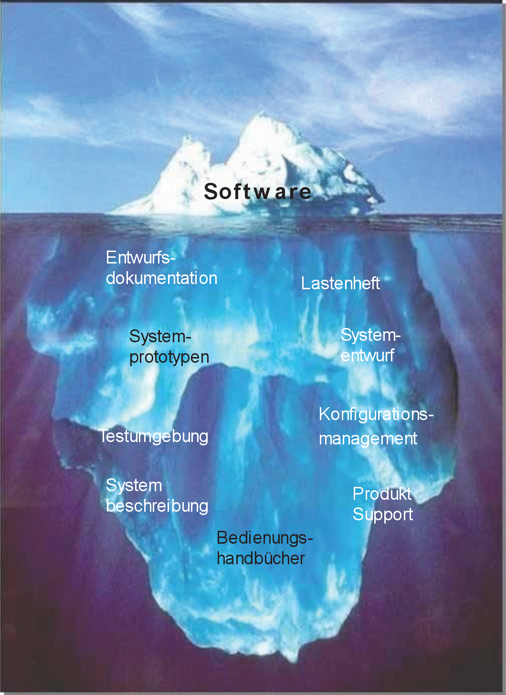
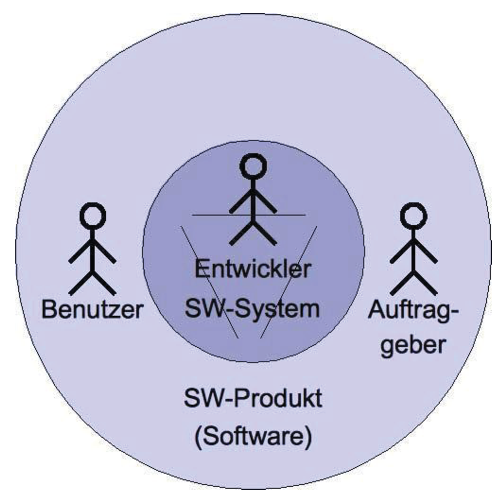

***
 
 

### Fachhochschule Bielefeld

### Softwaretechnik und Programmierung  
###### Prof. Dr. Jörg Brunsmann
 
 
 

# Software Engineering  

## Kapitel 1. Einleitung  
 
 
 

### *(Kommentare der Projektgruppe in Kursiv)*
 
 
 

***
FH Bielefeld | Software Engineering | Seite 1  
 
 
 

***
 
 
 

# Begrifflichkeit:  
 
 

## „Software Engineering“ = „Softwaretechnik“  
 

### *Die Softwaretechnik ist eine deutschsprachige Übersetzung des engl. Begriffs Software Engineering (SWE) und beschäftigt sich mit der Herstellung oder Entwicklung von Software, der Organisation und Modellierung der zugehörigen Datenstrukturen und dem Betrieb von Softwaresystemen. [Quelle: Wikipedia]*
 
 
 
 
 
 
 

***
FH Bielefeld | Software Engineering | Seite 2
 
 
 

***
 

# **Lernziele für heute**  
 
 

- ### Verstehen, warum Software schwer zu entwickeln ist
 
- ### Erklären können, warum Softwaretechnik notwendig ist  

- ### Unterschiedliche Arten von Software kennen  

- ### Wissen, welche typischen Phasen in einem Softwareprojekt existieren  

- ### Verständnis für Rollen in einem Softwareprojekt entwickeln  

- ### Verstehen, dass zur Softwareentwicklung mehr gehört als die reine Programmierung

 
 
 

***
FH Bielefeld | Software Engineering | Seite 3
 
 
 

***
 
 
 

# Was ist Software?
 
 

### *Software [ˈsɒf(t)wɛː] (dt. = weiche Ware [von] soft = leicht veränderbare Komponenten […], Komplement zu ‚Hardware‘ für die physischen Komponenten) ist ein Sammelbegriff für Programme und die zugehörigen Daten. Sie kann als Beiwerk zusätzlich Bestandteile wie z. B. die Softwaredokumentation in der digitalen oder gedruckten Form eines Handbuchs enthalten. [Quelle: Wikipedia]*

### *Software bestimmt, was ein softwaregesteuertes Gerät tut und wie es das tut (in etwa vergleichbar mit einem Manuskript). Die Hardware (das Gerät selbst) führt Software aus (arbeitet sie ab) und setzt sie so in die Tat um. Software ist die Gesamtheit von Informationen, die man der Hardware hinzufügen muss, damit ein softwaregesteuertes Gerät für ein definiertes Aufgabenspektrum nutzbar wird. [Quelle: Wikipedia]*
 
 
 
 

***
FH Bielefeld | Software Engineering | Seite 4
 
 
 

***

## Was ist Software?
 

### Die Software ist nur die Spitze des Eisbergs des Software-Produkts
 

### Software ist ein umfassenderer Begriff als „Programm“

- ### Software besteht ebenfalls aus der zugehörigen Dokumentation

- ### Software enthält alle Elemente, die für den Betrieb notwendig sind. z.B. Datenbankskripte, Dokumentation, Betriebshandbücher, usw.
 
 
 
 
 

***
FH Bielefeld | Software Engineering | Seite 5
 
 
 

***
## Was ist Software?
### - „Programme, zugehörige Daten und Dokumentationen, die es zusammengefasst erlauben, mit Hilfe eines Computers Aufgaben zu erledigen.“

 

### Softwaresystem
#### Ein *Softwaresystem* ist ein System, dessen Bestandteile und Elemente aus Software bestehen („innere“ Sicht des Softwareentwicklers)
 

### Softwareprodukt
#### Ein *Softwareprodukt* ist ein für einen Auftraggeber erstelltes Softwaresystem („äußere“ Sicht)

***
FH Bielefeld | Software Engineering | Seite 6
 
 
 

***
## Arten von Software
 

- ### Systemsoftware (z.B. Betriebssystem)

- ### Anwendungssoftware (z.B. Büroanwendungen, Office)

- ### Standardsoftware (anpassbare Software für anonyme Kunden, z.B. SAP)  

- ### Individualsoftware  

    - #### Speziell für einen Kunden/Auftraggeber entwickelte Software
  
    - #### Exakt auf die Bedürfnisse des Kunden zugeschneidertes Produkt  
    
    - #### Relativ zeitaufwändige und teure Entwicklung  

    - #### Typische Beispiele: Software zur Unterstützung spezieller Geschäftsprozesse  

- ### Eingebettete Systeme (Steuerungssoftware für Geräte)

- ### Echzeitsysteme (z.B. Flugüberwachung und Kraftwerkssteuerung)

- ### Informationssysteme (datenbankgestützte Verwaltung von Information), oft webbasiert

***
FH Bielefeld | Software Engineering | Seite 7
 
 
 

***
## Eigenschaften von Software
 
 
 

- ### Software kann man nicht anfassen: Software ist immateriell

- ### Entwicklungsfortschritt ist nicht objektiv messbar

- ### Anders als materielle Produkte verschleißt Software nicht 

- ### Software verschleißt zwar nicht, altert aber dennoch

    - #### Die Umgebung, in der Software eingesetzt wird, ändert sich ständig
  
    - #### Software muss daher diesen Änderungen immer wieder angepasst werden
 
 
 

***
FH Bielefeld | Software Engineering | Seite 8
 
 
 

***
 
 
 

# Software Projekte
 
 

 
 
 

***
FH Bielefeld | Software Engineering | Seite 9
 
 
 

***

## Was ist ein Projekt ?
- ### Ein Projekt ist ein Vorhaben, das im wesentlichen durch die Einmaligkeit der Bedingungen in ihrer Gesamtheit gekennzeichnet ist, wie z.B.:
 
    - #### Zielvorgabe
      
    - #### Zeitliche, finanzielle, personelle oder andere Begrenzungen

| **Projektgröße** | **Kriterien** | **Beispiele** |    
| ------------ | --------- | ----      |    
| Light        | Bis zu 6 Personen Personen-Monate (PM): 0-8 Anzahl Technologien: <5 | Rechenprobleme, Algorithmen |  
| Medium       | 10-30 Personen 9-24 PM 5-12 Technologien | Buchhaltung, Lagerverwaltung |  
| Heavy        | 50-100 Personen 25-45 PM 12-20 Technologien | Compiler, Datenbank |  
| Super Heavy  | ab 100 Personen >45 PM >20 Technologien | Raumfahrt, Atomkraftwerk, elektronische Börse |  

***
FH Bielefeld | Software Engineering | Seite 10
 
 
 

