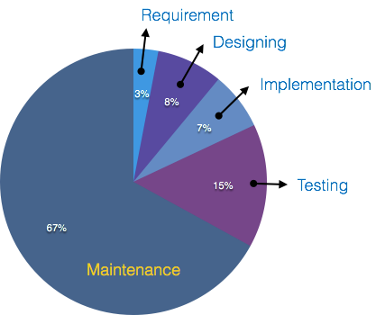
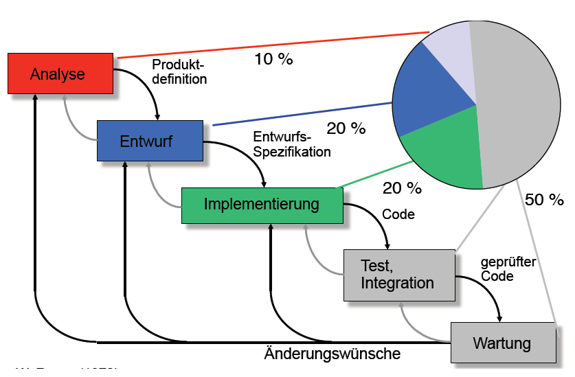
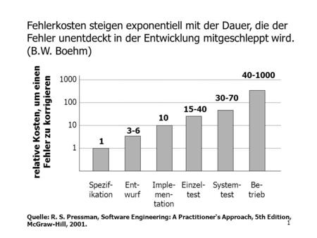

***
# Softwarekosten

## Die wichtigsten Kostenarten während der Softwareentwicklung sind:
### - Personalkosten (mit Abstand der größte Posten) - Lizenzkosten für zugekaufte Softwarekomponenten - anteilige Kosten für Entwicklungsumgebung (Hardware, Softwaretools - Auslagerungen/ Zukauf von Entwicklungsleistungen - externe Prüfungen - Recherchekosten (Normenrecherche, Urheberrechte...) - Sonstiges (Büromaterial, Reisekosten, usw.)

 

### Während der 'Entstehungsphase' kann man als Faustregel von folgender Aufwandsverteilung ausgehen:

 
 
 

### Wie man sieht, ist der Aufwand (und damit die Kosten), für das Testen der Software fast so hoch wie die Entwicklungskosten für Design, Implementierung und Komponententest.
 
 
 
 

***
 

## Nach der Entwicklung:
### In die Wartung fließt traditionell der größte Teil des Aufwandes des Software-Lebenszyklus. Der für die Wartung einzurechnende Aufwand steigt darüber hinaus stetig - rechnete man noch in den 1970er Jahren damit, dass der Wartungsaufwand 35 % bis 60 % des Gesamtaufwandes des Softwarelebenszyklusses ausmacht, stieg dieser bis Ende der 1990er Jahre auf 80 % bis 90 %. *[Wikipedia]*
 

    

 

### *Die Wartung der Software ist somit deutlich teurer als die Entwicklung! Die Mehrzahl der Softwareentwickler sind mit Pflegearbeiten beschäftigt.*
 

***
 

## Kostenfaktoren:
### Die maßgeblichen Faktoren für die Kosten eines Softwareprojektes sind:
#### - Typ des zu entwickelnden Systems (Größe, Umfang, Komplexität -> Quantitätsanforderung) - geforderte Performance (als Qualitätsanforderung) - geforderte Systemzuverlässigkeit (als Qualitätsanforderung) - Produktivität der Mitarbeiter

### Zur Aufwandsschätzung eines Projektes gibt es verschiedene Basismethoden.  (Analogiemethode, Relationsmethode, Multiplikationsmethode...)

## Kostenverteilung:
### Die Verteilung der Kosten auf die einzelnen Phasen der Softwareentwicklung ist abhängig vom benutzten Vorgehensmodell. (z.B. Wasserfallmodell, V-Modell, iterative Modelle...)

    

#### Aufwandsverteilung beim Wasserfall-Modell
 

***

 

## Fehler als Kostenfaktor:

### Fehler sind ein wichtiger Kostenfaktor bei der Softwareentwicklung. Wie stark sich ein Fehler als zusätzlicher Aufwand bemerkbar macht, hängt maßgeblich davon ab, zu welchem Zeitpunkt er entdeckt und behoben wird.

### Wird der Fehler früh erkannt, kann einfach die Spezifikation angepasst werden. Tritt er erst im Feldeinsatz auf oder wird erst dort bemerkt, stehen im schlimmsten Fall komplette Systeme still.

    

***

 

### Fehler entstehen aus offensichtlichen Gründen in den vorderen Phasen des Software-Lebenszyklus, also während der Analysen, des Entwurfs und der Implementierung. 
### Die Fehlererkennung erfolgt zu einem großen Teil erst im hinteren Teil des Lebenszyklus, überwiegend während der Modul- und Systemtests.
### Die Gefahr, einen Fehler lange während der Entwicklung mitzuschleppen und damit hohen Aufwand und hohe Kosten zu generieren, ist daher  relativ groß.

    

 

***
 

## Unter den Voraussetzungen:
### - mehr als eine Person entwickelt die Software bzw. das Softwareprodukt 
### - mehr als eine Version der Software existiert

## soll das *Software-Engineering* als Werkzeug dienen, die soeben dargestellten Probleme bei der Softwareentwicklung nicht entstehen zu lassen, zu beseitigen oder zumindest abzumildern.
 
 

## Damit ergeben sich zu diesem Zeitpunkt die Fragen:
 
 

# Was ist *Software-Engineering*?  
# Wie funktioniert *Software-Engineering*?
 
 
 
 
 

***
 

## Was ist Software Engineering?

## Software  +  Engineering (Ingenieurwissenschaften)
 

### "Unter Softwaretechnik (engl. Software Engineering) versteht man allgemein die (Ingenieur-) Wissenschaft, die die kosteneffiziente Entwicklung von qualitativ hochwertiger Software behandelt."
*Fachgruppe Softwaretechnik der Gesellschaft für Informatik*
### "Softwaretechnik, Softwaretechnologie, Software-Engineering das, –, Teilgebiet der Informatik, das sich mit Methoden und Werkzeugen für das ingenieurmäßige Entwerfen, Herstellen und Implementieren von Software befasst." 
*Brockhaus*
 
### Softwaretechnik: Zielorientierte Bereitstellung und systematische Verwendung von Prinzipien, Methoden und Werkzeugen für die arbeitsteilige, ingenieurmäßige Entwicklung und Anwendung von umfangreichen Softwaresystemen. Zielorientiert bedeutet die Berücksichtigung z. B. von Kosten, Zeit, Qualität.
*Helmut Balzert, Lehrbuch der Softwaretechnik*
 
 
 

***
 

## Phasen des Software Engineering
### Im Folgenden werden einige wichtige Aspekte und typische Stufen der Projektentwicklung dargestellt, die in der Praxis mehr oder weniger ausgeprägt zum Tragen kommen.

    

 
 

***
 

## Softwaretechnik als Teilgebiet der Informatik
### Die Softwaretechnik ist eine Teildisziplin der Informatik. Die Kerninformatik gliedert man in Theoretische, Praktische und Technische Informatik (siehe Abbildung). Die Softwaretechnik zählt zur Praktischen Informatik.
*Helmut Balzert, Lehrbuch der Softwaretechnik*
 
 

    

 

***
 

## Ziele des Software Engineerings

### Bei der Softwaretechnik handelt es sich um eine Ingenieurdisziplin. In der Regel gibt es nicht »die« Lösung für ein Problem, sondern Ziel ist, marktorientiert den optimalen Kompromiss zu finden. Ingenieurmäßig bedeutet hier auch »kein Künstlertum«.
*Helmut Balzert, Lehrbuch der Softwaretechnik*

### Ziel der Softwaretechnik ist somit das Erreichen einer hohen (ausreichenden) Softwarequalität bei gleichzeitiger Minimierung der Softwarekosten unter folgenden Aspekten:

- ### Entwicklungsaspekt: Schnelle und effiziente Entwicklung des Produkts (Produktivität der Mitarbeiter, geringe Fehlerquote)

- ### Qualitätssicherungsaspekt: Einhaltung der geforderten Qualitätsmerkmale (hinsichtlich Stabilität, Performance, Verfügbarkeit)

- ### Managementaspekt: Kontrollierte Projektabwicklung (innerhalb der Aufwandsabschätzung und des Zeitplans)

- ### Wartungsaspekt: Sicherstellung der Wartbarkeit, Erweiterbarkeit, Wiederverwendbarkeit
 
 

***
 

## Techniken des Software Engineering

### Um die dargestellten Ziele der Disziplin zu erreichen, bedient sich das Software Engineering der folgenden Techniken:

- ### Die Qualität des zu entwickelnden Softwareprodukts wird in den Mittelpunkt gestellt, um Kundenzufriedenheit zu erzielen, die Sicherheit bei der Anwendung des Produktes zu gewährleisten und Stabilität/Verfügbarkeit zu erreichen.

- ### Die Entwicklung basiert auf (agilen) Vorgehensmodellen, die einen allgemeinen Rahmen für den organisatorischen Prozess der Softwareerstellung definieren. Dadurch wird auf bewährte, systematische Vorgehensweisen zurückgegriffen. 

- ### Die Entwicklung wird methodisch anhand von objektorientierter Analyse (OOA) und objektorientiertem Design (OOD) (jeweils mit UML) durchgeführt. Dadurch wird der Übergang  zur Implementierung in einer objektorientierten Programmiersprache erleichtert.

- ### Es werden Softwarewerkzeuge zur Beherrschung der Komplexität eingesetzt.(CASE-Werkzeuge, Projektmanagement-Werkzeuge, Testsysteme, IDE (Integrated Development Environment))

### Softwaretechnik ist eine *Ingenieur-Disziplin*, das erfordert:
### - Systematisches Vorgehen - Denken in Baugruppen - Wiederverwendung - Prozessstrukturierung - Prozessbegleitendes Qualitätsbewusstsein

***

## Zusammenfassung
 

- ### Software Engineering ist eine Ingenieur-Disziplin, die sich mit allen Aspekten der Softwareentwicklung und Softwarewartung beschäftigt.

- ### Ziel des Software Engineerings ist die Erreichung einer hohen Softwarequalität und die Minimierung der Softwarekosten.

- ### Software Engineering ist mehr als Technik und befasst sich mit Konzepten, Methoden und Werkzeugen für die professionelle Softwareentwicklung

- ### Softwareprodukte bestehen aus Programmen und der Dokumentation

- ### Software Ingenieure arbeiten in Teams in Software Projekten methodisch und strukturiert und kommunizieren mit Kunden und Teammitgliedern

- ### Software Ingenieure beherrschen die Technik und lassen sich nicht von der Technik beherrschen

- ### Der Softwareentwicklungsprozess besteht aus Phasen, die bei der Entwicklung des Softwareprodukts involviert sind. Die grundlegenden Phasen sind Analyse, Entwurf, Implementierung, Integration, Test, Wartung und Weiterentwicklung.
 

***

***

 
 
 
 
 
 

## Danke für Ihre Aufmerksamkeit.
 
 
 
 

## Fragen, Wünsche, Anregungen?
 
 
 
 
 
 
 
 
 
 

***

